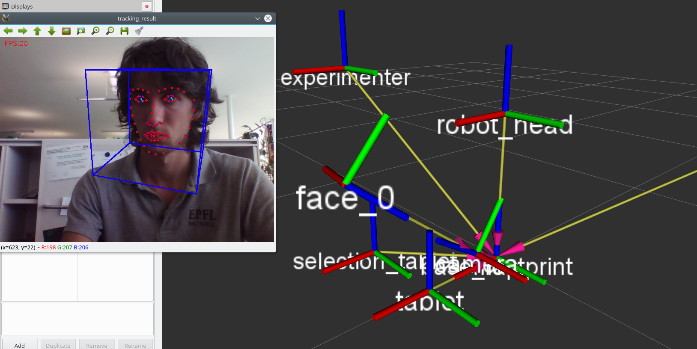

# openface_tracker
==================

New version of attention_tracker (https://github.com/chili-epfl/attention-tracker) using OpenFace Project https://github.com/TadasBaltrusaitis/OpenFace



### installation:

1. follow https://github.com/TadasBaltrusaitis/OpenFace/wiki/Unix-Installation for Dependencies (for ubuntu 16.04 follow instructions for 14.04)

2. Since some of ROS Kinetic libraries are not linked with GCC versions >= 5.X (http://answers.ros.org/question/234322/linker-error-on-ros-kinetic-ubuntu-1604/), we now us clang. if you don't have clang installed just run:

```
$ sudo apt-get install clang
```


>if you have GCC version < 5.X and you don't want to compile with clang, juste comment these lines in CMakelists.txt:

>```
>set(CMAKE_CXX_COMPILER "clang++")
>set(CMAKE_C_COMPILER "clang") 
>```

3. openface_tracker is a ROS pakage, assuming you already have a catkin workspace (http://wiki.ros.org/catkin/Tutorials/create_a_workspace):

```
$ cd (your catkin_ws)/src && git clone https://github.com/chili-epfl/openface_tracker.git
```
```
$ cd .. && catkin_make
```
```
$ catkin_make install
```

### usage: 

you can specify the camera device you yant to use (0 by default). If you want to use an external camera (# 1):
```
$ roslaunch openface_tracker/openface_tracker.launch camera_device_arg:= 1
```
